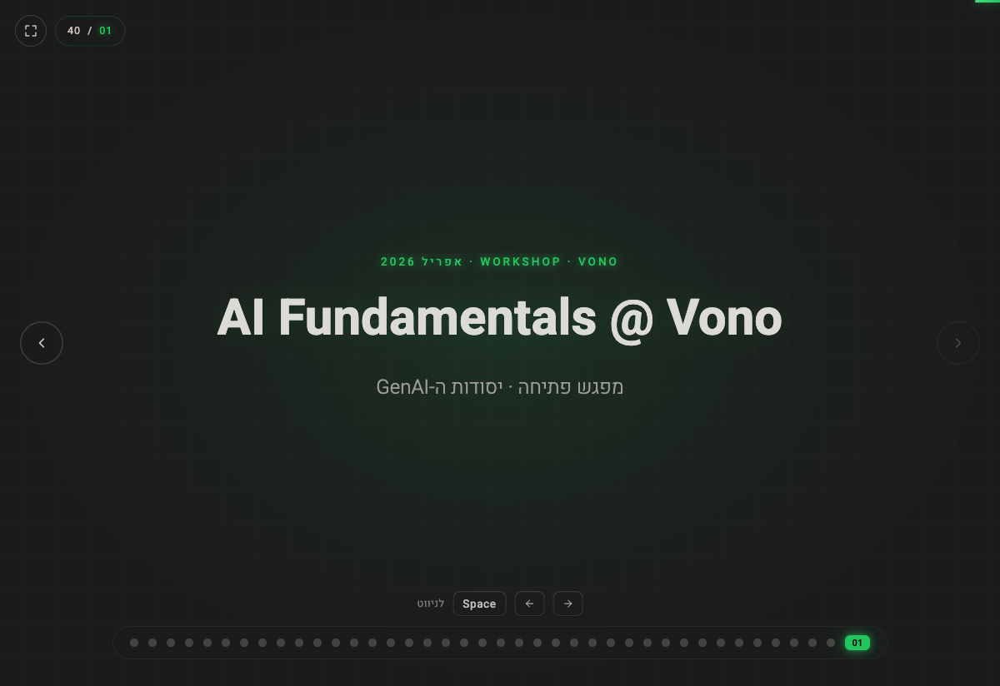
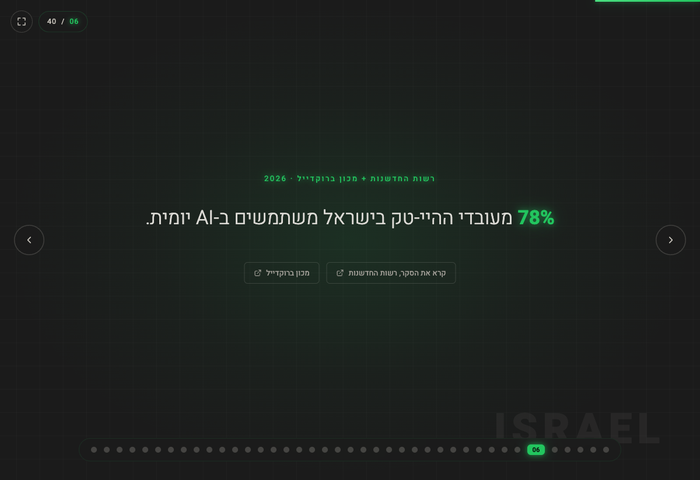
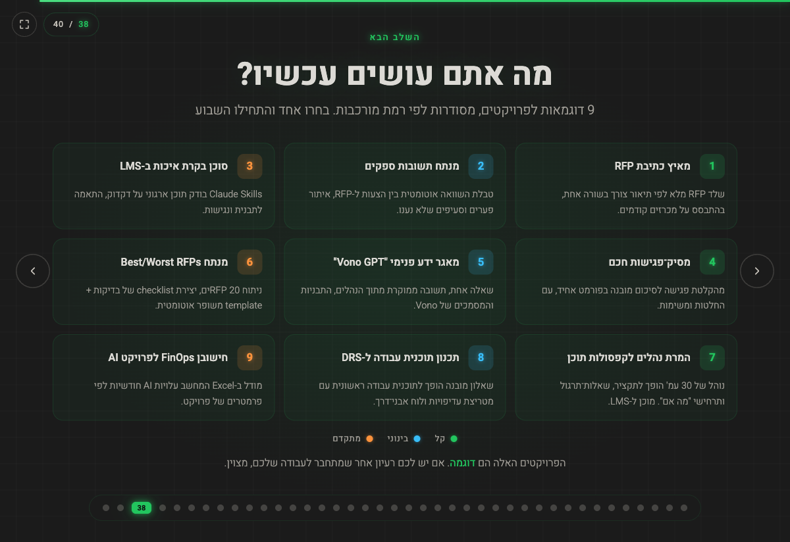
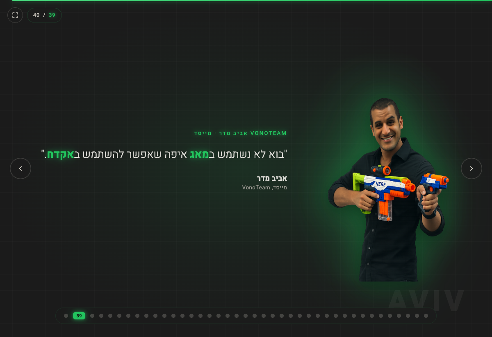

<div align="center">

# AI Fundamentals @ Vono

### מצגת סדנה אינטראקטיבית בעברית · יסודות ה-AI ל-VonoTeam · אפריל 2026

[](https://booya1986.github.io/AI-Fundamentals-Vono/)
[](./index.html)
[](./index.html)

**Live deck →** [booya1986.github.io/AI-Fundamentals-Vono](https://booya1986.github.io/AI-Fundamentals-Vono/)

[](https://booya1986.github.io/AI-Fundamentals-Vono/)

</div>

---

## על המצגת

40 שקופיות אינטראקטיביות שמסבירות **מה זה Gen AI, איך הוא עובד, ומה לעשות איתו ב-Vono**.
מבוססות על מחקר עדכני (McKinsey · Deloitte · HBR · WEF · Gartner) ומותאמות לעולם הייעוץ והכתיבת RFP.

| | |
|---|---|
| 🟢 **40 שקופיות** | RTL מלא, פונט Heebo |
| 🟢 **22 פריסות** | Title · About · Yes/No · Stat · Quote · Cards · Timeline · Compare · Tokens · Probability · ועוד |
| 🟢 **קישורים לכתבות** | כל סטטיסטיקה מקושרת למקור המקורי |
| 🟢 **ניווט מלא** | מקלדת · עכבר · מגע · מסך מלא |
| 🟢 **קובץ יחיד** | HTML + CSS + JS inline, אין build, אין dependencies |

---

## הרצה

### לייב

```
https://booya1986.github.io/AI-Fundamentals-Vono/
```

### מקומית

```bash
open index.html
```

---

## ניווט

| קיצור | פעולה |
|:-----:|------|
| `←` | קדימה _(RTL)_ |
| `→` | אחורה |
| `Space` · `PageDown` | קדימה |
| `PageUp` | אחורה |
| `Home` · `End` | תחילת / סוף הדק |
| `F` | מסך מלא |
| Click on dot | מעבר ישיר לשקף |
| Swipe שמאלה | קדימה (במגע) |

---

## תוכן

| חלק | נושא |
|:---:|------|
| **1** | פתיחה — מי אני · מה אנחנו עושים פה · סבב פתיחה |
| **2** | תמונת מצב 2026 — 7 סטטיסטיקות מהמחקרים העדכניים |
| **3** | תולדות ה-Gen AI — ציר זמן: 2022 → היום → קדימה |
| **4** | איך עובד מודל שפה — טוקנים · הסתברויות · Attention · 5 התנהגויות |
| **5** | דמו חי — אותה שאלה, שלושה כלים, שלוש תשובות |
| **6** | השחקנים — OpenAI · Anthropic · Google · Perplexity |
| **7** | 5 המושגים — Context Window · Prompting · RAG · Reasoning · Tool Use |
| **8** | מפת הכלים — בחירה לפי משימה |
| **9** | חשיבה ארגונית — אוטומציה מול סוכן |
| **10** | הפרויקטים — 9 דוגמאות לבחירה (קל / בינוני / מתקדם) |
| _Closing_ | ציטוט המייסד · אביב מדר · Let's Connect |

---

## מבנה הפרויקט

```
AI-Fundamentals-Vono/
├── index.html         ← כל הדק (HTML + CSS + JS inline)
├── assets/
│   ├── avi.png        ← פורטרט (שקף "מי אני")
│   └── image.png      ← אביב מדר (שקף הציטוט הסוגר)
├── README.md          ← הקובץ הזה
├── CLAUDE.md          ← הוראות לעבודה עם הקוד
└── .gitignore
```

לפרטי הארכיטקטורה, ראו **[CLAUDE.md](./CLAUDE.md)**.

---

## דוגמאות שקפים

<table>
<tr>
<td width="50%"></td>
<td width="50%"></td>
</tr>
<tr>
<td colspan="2"></td>
</tr>
</table>

---

## המוצג

**[אבי לוי](https://avilevi.co.il/)** — Learning & Development Team Leader · AI Innovator · 15+ Years Building Learning Organizations

[Blog](https://avilevi.co.il/) ·
[LinkedIn](https://www.linkedin.com/in/avi-levi-%F0%9F%87%AE%F0%9F%87%B1-59011491/) ·
[GitHub](https://github.com/booya1986) ·
[YouTube](https://www.youtube.com/channel/UCdz7iR7sYg2gevHXEyeeM1Q) ·
[Instagram](https://www.instagram.com/avi.j.levi/) ·
[TikTok](https://www.tiktok.com/@avibooyalevi)

---

<div align="center">

_VonoTeam Workshop · April 2026_

</div>
